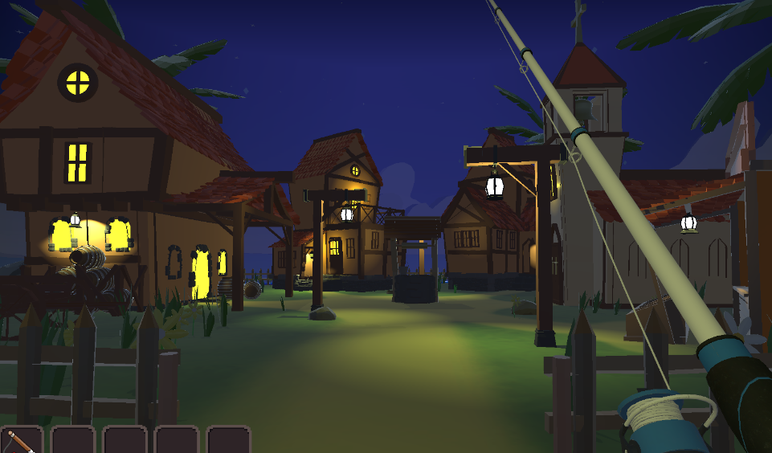
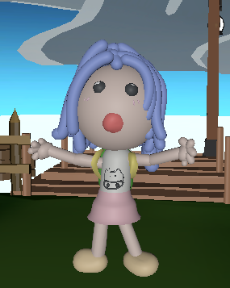
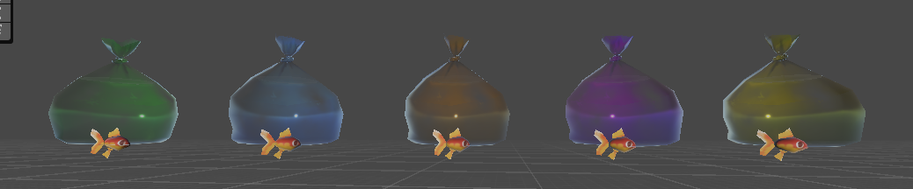
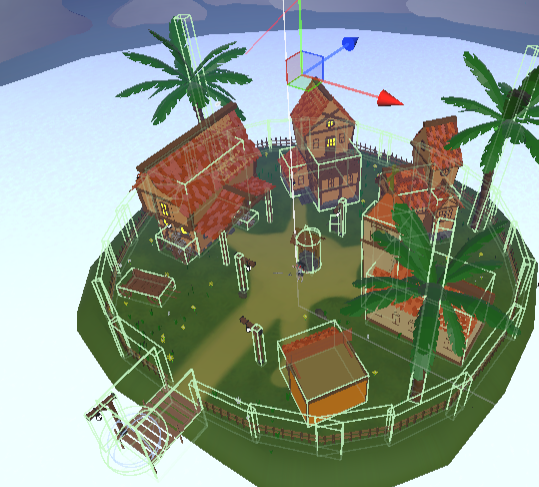

# 🎣 CatFishing - Trabajo de Fin de Grado (DAM)

> Un videojuego 3D de simulación, recolección y gestión que combina la experiencia *cozy* con mecánicas profundas de progresión.

[](https://github.com/inoixh/TFG_2DAM)
[](LICENSE)
[](https://unity.com)
[](https://docs.microsoft.com/es-es/dotnet/csharp/)
[](https://firebase.google.com)

---

## 📋 Contenido del Proyecto

```
TFG_2DAM/
├── Desarrollo/                          # Documentación y recursos de desarrollo
│   ├── Memoria_TFG_Ainhoa.pdf          # Memoria final del proyecto
│   ├── Propuesta TFG.pdf                # Propuesta inicial
│   ├── Fotos3D/                         # Screenshots de modelos 3D
│   │   ├── Isla.png                    # Visualización de la isla
│   │   ├── Player.png                  # Modelo del jugador
│   │   ├── Peces.png                   # Modelos de peces
│   │   ├── BattleCat.png               # Modelo de gato de batalla
│   │   └── CollidersIsla.png           # Sistema de colisiones
│   └── jsonBD/                          # Base de datos en JSON
│       ├── cats.json                   # Datos de gatos (características, ID, rareza)
│       ├── fish.json                   # Datos de peces (tipos, rareza, ubicación)
│       ├── items.json                  # Objetos del mercado
│       └── services.json               # Servicios disponibles
└── Unity/                               # Proyecto del videojuego
    └── CatFishing/                      # Proyecto principal Unity
        ├── Assets/                      # Recursos del juego
        ├── Packages/                    # Dependencias UPM
        ├── ProjectSettings/             # Configuración del proyecto
        ├── Run/                         # Builds compilados
        └── CatFishing.slnx              # Solución de Visual Studio
```

---

## 📖 Descripción del Proyecto

**CatFishing** es un videojuego de gestión y simulación desarrollado como Trabajo de Fin de Grado para el ciclo de **Desarrollo de Aplicaciones Multiplataforma (DAM)** en la Universidad Alfonso X el Sabio.

El juego sitúa al jugador en una tranquila isla donde el objetivo principal es **pescar diversos peces para crear vínculos emocionales con personajes felinos**. A diferencia de otros juegos de gestión convencionales, CatFishing pone un gran énfasis en:

- **Experiencia *cozy* (tranquila y libre de estrés)**: Cada interacción es diseñada para ser relajante.
- **Vínculos emocionales**: Los gatos generados dinámicamente tienen personalidades únicas y reaccionan a tu comportamiento.
- **Sostenibilidad ambiental**: El proyecto integra conceptos de reciclaje, crafteo y cuidado del ecosistema de la isla.

---

## ✨ Características Principales

### 🎣 Minijuego de Pesca Interactivo
Sistema de pesca con mecánicas fluidas donde debes mantener el cursor alineado con los movimientos del pez durante un tiempo determinado para capturarlo exitosamente.

### 🐾 Sistema Dinámico de Afinidad
- Cada gato generado tiene **características, ID y rareza propios**
- Interactuar y entregar el pez favorito aumenta la **amistad progresivamente**
- Los gatos cambian de estado emocional en función de tu relación con ellos
- Sistema de personalidad que influye en el comportamiento

### 📖 Colección y Progresión
- **Álbum interactivo** que registra todos los peces descubiertos
- Sistema de **niveles de amistad** con cada gato
- Desbloqueo de contenido especial según progresión
- Estadísticas de juego en tiempo real

### 🏪 Economía de Mercado y Sistema de Misiones
- **Tienda interactiva** para comprar ítems y contratar servicios
- Servicio de **ayudante de pesca** para mejorar productividad
- Sistema económico basado en la venta de recursos
- **Misiones dinámicas** que impulsan la progresión del jugador
- Recompensas variadas según dificultad

### ☁️ Autenticación y Guardado en la Nube (BaaS)
- **Autenticación de usuarios** integrada con Firebase Authentication
- Persistencia de datos totalmente sincronizada
- **Hasta 3 slots de guardado** por cuenta de usuario
- Sincronización automática entre dispositivos

### 💬 Interfaz Intuitiva (UI)
- **Sistema de detección de proximidad** que despliega diálogos contextuales
- Instrucciones en pantalla ("Pulsa espacio") que aparecen solo cuando es relevante
- Menús intuitivos y responsivos
- Accesibilidad mejorada

---

## 🛠️ Tecnologías y Arquitectura

### Stack Tecnológico

| Componente | Tecnología |
|-----------|-----------|
| **Motor Gráfico** | Unity 3D |
| **Lenguaje Principal** | C# |
| **Backend / Base de Datos** | Firebase (Cloud Firestore & Authentication) |
| **Testing** | NUnit |
| **Control de Versiones** | Git / GitHub |

### Arquitectura

El proyecto sigue una **arquitectura Data-Driven (Orientada a Datos)**, donde el contenido del juego se alimenta dinámicamente desde la nube:

```
┌─────────────────────────────────────────────┐
│         Cliente Unity (C#)                   │
│  ├─ Input Manager                           │
│  ├─ UI System                               │
│  ├─ Game Logic                              │
│  └─ Local Cache Manager                     │
└──────────────┬──────────────────────────────┘
               │ Firebase SDK
┌──────────────▼──────────────────────────────┐
│      Firebase Backend Services              │
│  ├─ Cloud Firestore (Base de Datos)        │
│  ├─ Authentication                          │
│  ├─ Cloud Storage                           │
│  └─ Realtime Database (sincronización)     │
└─────────────────────────────────────────────┘
```

---

## 🗄️ Estructura de Datos (Firestore)

El ecosistema del juego está centralizado en una base de datos con la siguiente estructura:

### Colecciones Principales

**`users`** - Gestión de cuentas y progresión
- Autenticación de usuarios
- Ranuras de guardado (`save_slots`)
- Progresión del juego
- Estadísticas de jugador

**`cats`** - Especies felinas disponibles
- Datos estáticos de razas
- Características y rareza
- Atributos de personalidad
- Preferencias alimentarias

**`fish`** - Especies de peces
- Tipos de peces disponibles
- Rareza y ubicación
- Atributos especiales
- Valor en mercado

**`items`** - Objetos del mercado
- Inventario disponible
- Precios y rareza
- Descripciones
- Efectos especiales

**`services`** - Servicios y ayudantes
- Ayudante de pesca
- Mejoras de productividad
- Costos asociados
- Efectos en gameplay

**`quests`** - Sistema de misiones
- Misiones activas
- Requisitos y objetivos
- Recompensas
- Estados de progresión

---

## 📁 Estructura de Carpetas - Desarrollo

### `/Desarrollo` - Documentación y Assets

#### Documentos
- **Memoria_TFG_Ainhoa.pdf** (~1.7 MB)
  - Documentación técnica completa del proyecto
  - Análisis de requisitos
  - Diseño de sistemas
  - Conclusiones y resultados

- **Propuesta TFG.pdf** (~31 KB)
  - Propuesta inicial del proyecto
  - Objetivos y alcance
  - Recursos necesarios

#### `/Fotos3D` - Visualización de Modelos 3D
Capturas y renders de los elementos visuales del juego:
- **Isla.png** - Mapa principal del juego
- **Player.png** - Modelo del personaje jugable
- **Peces.png** - Galería de modelos de peces
- **BattleCat.png** - Modelo de gato combatiente
- **CollidersIsla.png** - Visualización del sistema de colisiones

#### `/jsonBD` - Base de Datos en JSON
Archivos de configuración y datos del juego:
- **cats.json** (~134 KB) - Base de datos de gatos con todas sus características
- **fish.json** (~12 KB) - Definición de especies de peces
- **items.json** (~6 KB) - Catálogo de objetos del mercado
- **services.json** (~3 KB) - Servicios y ayudantes disponibles

---

## 📁 Estructura de Carpetas - Unity

### `/Unity/CatFishing` - Proyecto Principal

```
CatFishing/
├── Assets/                  # Recursos del juego
│   ├── Scripts/            # Código fuente (C#)
│   ├── Scenes/             # Escenas del juego
│   ├── Models/             # Modelos 3D
│   ├── Textures/           # Texturas y materiales
│   ├── Audio/              # Música y efectos de sonido
│   ├── Prefabs/            # Prefabs reutilizables
│   ├── UI/                 # Recursos de interfaz
│   └── ExternalDependencyManager/  # Gestor de dependencias
│
├── Packages/               # Dependencias UPM
│   └── manifest.json       # Especificación de paquetes
│
├── ProjectSettings/        # Configuración del proyecto Unity
│   ├── ProjectVersion.txt
│   ├── QualitySettings.asset
│   └── [otras configuraciones]
│
├── Run/                    # Builds compilados y ejecutables
│   ├── Windows/
│   ├── macOS/
│   ├── Linux/
│   └── WebGL/
│
├── .gitignore             # Configuración de Git
├── .vscode/               # Configuración de VS Code
├── CatFishing.slnx        # Solución de Visual Studio
└── README.md              # Este archivo

```

### Estructura Típica de Assets/Scripts

```
Assets/Scripts/
├── Core/                  # Sistemas principales
│   ├── GameManager.cs
│   ├── FirebaseManager.cs
│   └── DataManager.cs
│
├── Systems/               # Sistemas de juego
│   ├── FishingSystem/
│   ├── CatSystem/
│   ├── MarketSystem/
│   └── QuestSystem/
│
├── UI/                    # Scripts de interfaz
│   ├── MenuManager.cs
│   ├── UIController.cs
│   └── DialogueSystem.cs
│
├── Player/                # Scripts del jugador
│   ├── PlayerController.cs
│   ├── PlayerInventory.cs
│   └── PlayerStats.cs
│
├── NPCs/                  # Scripts de personajes
│   ├── CatBehavior.cs
│   ├── NPCInteraction.cs
│   └── Dialogue.cs
│
└── Utilities/             # Funciones auxiliares
    ├── InputManager.cs
    ├── AudioManager.cs
    └── SaveManager.cs
```

---

## 🚀 Instalación y Configuración

### Requisitos Previos
- **Unity 2022.3 LTS** o superior
- **C# 9.0** o compatible
- Cuenta de **Firebase** (configurada)
- **Git** para control de versiones

### Pasos de Configuración

1. **Clonar el repositorio**
   ```bash
   git clone https://github.com/inoixh/TFG_2DAM.git
   cd TFG_2DAM/Unity/CatFishing
   ```

2. **Abrir en Unity**
   - Abrir Unity Hub
   - Seleccionar "Abrir proyecto"
   - Navegar a `Unity/CatFishing`
   - Unity descargará las dependencias automáticamente

3. **Configurar Firebase**
   - Crear proyecto en [Firebase Console](https://console.firebase.google.com)
   - Descargar archivo `google-services.json` (Android) o `GoogleService-Info.plist` (iOS)
   - Colocar en la carpeta de configuración correspondiente
   - Configurar reglas de seguridad en Firestore

4. **Ejecutar el Proyecto**
   - Abrirlo en Editor: `File > Open Scene` y seleccionar la escena principal
   - Hacer click en el botón `Play` en el editor
   - O compilar para tu plataforma objetivo

### Compilación

```bash
# Compilar para Windows
unity -batchmode -nographics -projectPath ./Unity/CatFishing -buildWindowsPlayer ./Build/CatFishing.exe

# Compilar para macOS
unity -batchmode -nographics -projectPath ./Unity/CatFishing -buildOSXUniversalPlayer ./Build/CatFishing.app

# Compilar para Android
unity -batchmode -nographics -projectPath ./Unity/CatFishing -buildAndroidPlayer ./Build/CatFishing.apk
```

---

## 🧪 Testing

El proyecto utiliza **NUnit** para pruebas automatizadas:

```bash
# Ejecutar todas las pruebas
unity -batchmode -runTests -testPlatform editmode

# Ejecutar pruebas específicas
unity -batchmode -runTests -testPlatform editmode -testCategory "Systems"
```

Áreas principales de testing:
- **Sistemas de juego** (pesca, afinidad, mercado)
- **Integración con Firebase** (autenticación, sincronización)
- **Lógica de progresión** (misiones, desbloqueos)
- **Interfaz de usuario** (flujos de interacción)

---

## 📊 Características Técnicas Destacadas

### Arquitectura Modular
- Sistemas desacoplados y reutilizables
- Fácil mantenimiento y expansión
- Patrón Observer para eventos

### Sincronización en Tiempo Real
- Datos sincronizados entre dispositivos
- Caché local para juego offline
- Conflicto resolution automático

### Optimización de Rendimiento
- LOD (Level of Detail) en modelos 3D
- Culling de objetos fuera de pantalla
- Pooling de objetos para reducir GC

### Seguridad
- Autenticación segura con Firebase
- Reglas de seguridad en Firestore
- Validación de datos en cliente y servidor

---

## 📝 Control de Versiones

El proyecto utiliza **Git** para control de versiones. Ramas principales:

- **`main`** - Versión estable y lista para producción
- **`develop`** - Rama de desarrollo
- **`feature/*`** - Nuevas características
- **`bugfix/*`** - Correcciones de errores

---

## 🎓 Información Académica

**Título del Proyecto:** CatFishing - Videojuego de Gestión 3D

**Autor:** Ainhoa Fernández Vadillo

**Tutor:** Carlos Rufiángel

**Ciclo Formativo:** Desarrollo de Aplicaciones Multiplataforma (DAM)

**Centro:** Universidad Alfonso X el Sabio (UAX FP)

**Año Académico:** 2025-2026

**Estado:** ✅ Completado

---

## 📚 Documentación Adicional

- **Memoria Completa**: Ver archivo `Desarrollo/Memoria_TFG_Ainhoa.pdf`
- **Propuesta del Proyecto**: Ver archivo `Desarrollo/Propuesta TFG.pdf`
- **Datos del Juego**: Revisar archivos JSON en `Desarrollo/jsonBD/`

---

## 🤝 Contribuciones

Este es un proyecto académico de fin de grado. Las contribuciones están limitadas a propósitos de revisión. Para sugerencias o mejoras, contacta con el autor.

---

## 📧 Contacto

Para preguntas o información adicional sobre el proyecto:

- **Autor**: Ainhoa Fernández Vadillo
- **GitHub**: [@inoixh](https://github.com/inoixh)
- **Institución**: Universidad Alfonso X el Sabio

---

## 📄 Licencia

Este proyecto es **privado** y está protegido bajo licencia académica. No está permitida la distribución o uso comercial sin consentimiento explícito.

---

## 🎮 Galería

### Visualización de Modelos 3D


*Mapa principal de la isla donde ocurre el juego*


*Modelo del personaje jugable*


*Variedad de especies de peces capturables*


*Visualización del sistema de colisiones de la isla*

---

**Última actualización:** 2026-05-05

*CatFishing - Creado con ❤️ para el Trabajo de Fin de Grado en DAM*
